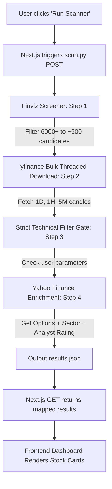

# Walkthrough: Smart Stock Scanner Redesign

We have successfully rebuilt the Smart Stock Scanner to run on a highly professional, robust 2-step architecture that scans all US stock markets efficiently without rate-limiting risks.

---

## 1. Redesigned Architecture

---

## 2. Implemented Technical Filters

A stock is only selected if it passes **all** of the following:

- **Price:** $10 to $50
- **Volume:** Average Daily Volume over 1M
- **ATR:** Over $1.00
- **1D Trend:** 1D MACD histogram > 0 AND 1D EMA 9 > 21 (OR bearish candle size shrinking by 30%+)
- **4H Trend:** 4H MACD histogram > 0 AND 4H EMA 9 > 21
- **1H Trend:** 1H MACD histogram > 0 AND 1H EMA 9 > 21 AND 1H ADX rising
- **Daily Movement:** Moved 1–2 points average in the last 3 days
- **Relative Position:** Not in the top 5% or bottom 5% of its 52-week range
- **5M Chart Quality:** 5-minute average volume > 1,000 to prevent illiquid, distorted charts
- **Analyst Gate:** Recommendation rating is **BUY** or **Strong Buy**

---

## 3. Mapped Frontend Card UI

The frontend dashboard now monitors the scanning state and pulls results from the background worker:
- **Polling:** Automatically tracks the progress of the scanning stages (Finviz → Downloading → Technicals → Enrichment).
- **Persistent State:** Saves scan results on the server so reloading the browser does not lose your trade-ready picks.
- **Card Badges:** Displays critical trading values (ATR, ADX, Average 3D Range, Options Sentiment badge, Sector icons) directly on the cards.
